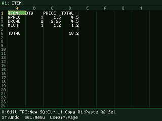
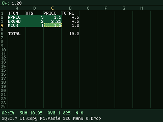
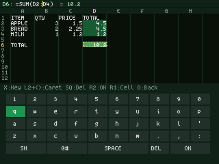
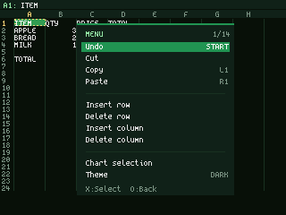
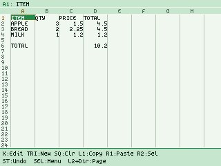
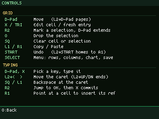
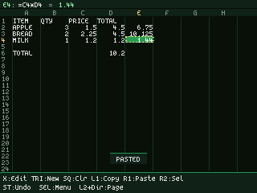
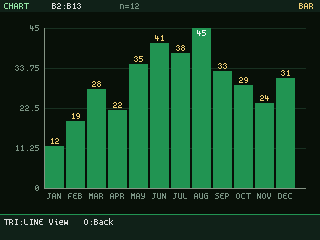
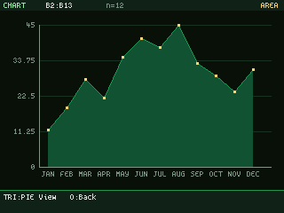
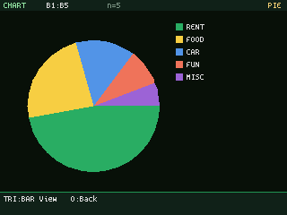

# PSXcel

**A spreadsheet that boots on a real PlayStation 1.**

PSX + Excel (and PSX + "cel", as in cells). A working, gamepad-driven spreadsheet
for the original PlayStation, written in Rust on the
[PSoXide](https://github.com/EBonura/PSoXide) SDK. Cells, formulas, charts, themes
and memory-card saves, all driven by a controller, running on 1994 hardware.



Inspired by the classic open-source terminal spreadsheet `sc` / `sc-im`.

## Features

- **Start menu**: boot to a title screen and pick a sample sheet (Budget,
  Sales chart, Expenses, Grades, Fibonacci, Functions, or Blank) or a memory-card
  save. Some samples open straight into a chart to show them off.
- **Grid**: A-Z columns x 1-50 rows, a smooth-scrolling viewport, and a formula
  bar that echoes the evaluated result of the selected cell. The cursor breathes
  and wears a marching-ants border, so it never gets lost on a busy sheet.
- **Selections with a live status bar**: **R2** marks a corner, the D-pad grows
  the rectangle, and the bottom bar reads out the range with its **SUM, AVG and
  COUNT** as you move, the way a desktop spreadsheet's status bar does. Clear,
  copy, cut, chart and paste all act on the selection.
- **On-screen keyboard with a real caret**: the PS1 has no keyboard, so cell text
  is typed with the D-pad on a PS4-style on-screen keyboard (letters, digits,
  symbols, shift). **L2 + LEFT/RIGHT** walks a blinking caret through the text and
  **L2 + UP/DOWN** jumps to either end, so a typo in the middle of a long formula
  is fixable in place. **R2** jumps the highlight straight to **OK**.
  The keyboard was born here as `keyboard.rs` and has since been promoted into the
  SDK as [`psx-osk`](https://github.com/EBonura/PSoXide/tree/main/sdk/crates/psx-osk),
  which the game now consumes.
- **Live formula feedback**: while you type, the bar shows what the formula
  currently evaluates to (or a dim `?` while it's still incomplete), and every
  range it names lights up in the grid in its own colour. You see `=SUM(A1:A9)`
  hit the right cells before committing it.
- **Formulas**: cell references, `+ - * /` with parentheses, `SUM / AVG / MIN /
  MAX / COUNT` ranges, `IF` with comparison operators, and `ABS / ROUND / INT /
  MOD`.
- **Real numbers**: `i64` fixed-point with four decimals and an effectively
  unbounded range for a spreadsheet.
- **Copy, cut and relative paste**: copy a cell or a rectangle, and pasting shifts
  every reference by the move, Excel-style (`=B2*C2` pasted a column right becomes
  `=C2*D2`). Paste a single formula over a selection to fill it.
- **Insert and delete rows and columns**: the grid shifts and every formula in the
  sheet is re-pointed to follow its data. A formula that referenced a row you
  deleted shows `#ERR` rather than silently reading whatever slid into its place.
- **Undo**: a six-deep history covering every edit, clear, paste, and row/column
  change. **START** steps back through it.
- **Charts**: view a selection as a **bar, line, area, or pie** chart, drawn from
  GPU primitives, with axis gridlines and tick labels, value labels on the bars,
  and category names read from the column beside the data. Triangle cycles the
  type.
- **Themes**: dark and light, both with the spreadsheet-green tint of Excel /
  Google Sheets.
- **Saves**: save sheets to a memory card under names you type, and browse them
  in a file picker (load or delete, with a confirmation before a delete). Saves
  are compressed and appear in the console's card manager like any game. A
  standard card holds up to 15 files.
- **On-screen help**: the full control map is one menu entry away, and every mode
  keeps its own legend in the bottom bar.

| Selection + status bar | Live formula + caret | Command menu |
|---|---|---|
|  |  |  |

| Light theme | Controls overlay | Relative paste |
|---|---|---|
|  |  |  |

| Bar | Area | Pie |
|---|---|---|
|  |  |  |

More screenshots in [docs/](docs/):

| | | |
|---|---|---|
| [Line chart](docs/chart-line.png) | [Cell reference pick](docs/pick.png) | [Fibonacci](docs/fibonacci.png) |
| [On-screen keyboard](docs/keyboard.png) | [Symbols keyboard page](docs/keyboard-symbols.png) | [Insert row](docs/insert-row.png) |
| [Save as](docs/saveas.png) | [Save browser](docs/browse.png) | [Delete confirmation](docs/confirm-delete.png) |
| [Memory-card smoke test](docs/memcard-smoketest.png) | [i64 divide probe](docs/i64-probe.png) | |

## Controls

Every mode prints its own legend along the bottom of the screen, and
**Select -> Help** shows this table in-game.

| Mode | Buttons |
|------|---------|
| **Grid** | D-pad move (auto-repeat), **L2 + D-pad** page jump, **X** edit, **Triangle** fresh entry, **R2** mark a selection (D-pad extends), **O** drop it, **Square** clear cell or selection, **L1** copy, **R1** paste, **Start** undo, **L2 + Start** home to A1, **Select** menu |
| **Typing** | D-pad pick a key (wraps), **X** activate, **L2 + LEFT/RIGHT** move the caret, **L2 + UP/DOWN** jump to either end, **L1** / **Square** backspace at the caret, **R2** jump to OK, **Start** commit outright, **R1** point at a cell, **O** cancel |
| **Pointing** | D-pad roam, **Square** anchor a range, **X** insert the reference (`B2`) or range (`A1:B5`), **O** back |
| **Chart** | **Triangle** cycle bar / line / area / pie, **O** back |
| **Browse** | D-pad move, **X** load, **Square** delete (asks first), **O** back |
| **Menu** | D-pad move, **X** select, **LEFT/RIGHT** toggle the theme, **O** back |

The **Select** menu holds what the pad has run out of buttons for: cut, insert and
delete row/column, chart the selection, theme, save, load, help. Each row also
shows its pad shortcut where it has one, so the menu teaches the button map
instead of hiding it.

To reference a cell mid-formula, press **R1** while typing, roam to the cell, and
**X** drops its address in at the caret. To fill a column, copy a formula with
**L1**, mark the target range with **R2** + D-pad, and **R1** pastes it with the
references shifted per row.

## Formulas

```
=A1+B2*3            references, + - * / and parentheses
=SUM(A1:A9)          ranges: SUM AVG MIN MAX COUNT
=IF(D5>5, 1, 0)      conditionals + comparisons: = < > <= >= <>
=MOD(A1,3)           math: ABS ROUND INT MOD
=10/3                -> 3.3333 (four decimals)
```

Values too wide for a column show in compact form (`1e10`) rather than being
truncated; select the cell to see the full value in the formula bar.

References are a single column letter + 1-based row. Names are case-insensitive
(`if` == `IF`, `a1` == `A1`). Errors show `#ERR`.

## Play it

The disc image is on [itch.io](https://bonnie-studios.itch.io/psxcel). PSXcel
also ships on the
[PSoXide Demo Disc](https://bonnie-studios.itch.io/psoxide-demo-disc), which
runs [in your browser](https://bonnie-studios.itch.io/psoxide) on the PSoXide
page, no console needed.

## Build

Install Rust through rustup, Make and host C/C++ build tools. The nightly
toolchain in `rust-toolchain.toml` selects `mipsel-sony-psx` and `build-std`.
The SDK and engine are retained at a historical Cargo pin in `psoxide-pin/`, which
`make` hydrates into `.psoxide` before building, so a plain clone is enough:

```sh
git clone https://github.com/EBonura/psxcel.git
cd psxcel

make build     # -> a PSX-EXE
make test      # host-side unit tests (formula engine, formatting, editor logic)
make disc      # -> a burnable .bin/.cue in dist/
make render    # headless emulator frame dump -> dist/frame.png
make install   # copy into the ~/Downloads/ps1 games library
```

The current [SDK](https://github.com/EBonura/PSoXide) and
[engine](https://github.com/EBonura/PSoXide-editor) live in separate repositories.
For integration builds, `PSOXIDE_FROM=/path/to/PSoXide-editor` accepts a
bootstrapped editor checkout. Keep the resulting BIN/CUE files together and
open the CUE in the separate
[PSoXide emulator](https://github.com/EBonura/PSoXide-emulator). The legacy
`make render` target and screenshot scripts use the historical hydrated
frontend; with split overrides, invoke the standalone frontend directly.
`make render` writes PPM on every host and additionally PNG when macOS `sips`
is available.

Every screenshot in `docs/` is generated, not hand-captured. `tools/shot.sh` boots
the disc in PSoXide's headless emulator, replays a scripted controller sequence,
and dumps the frame it lands on:

```sh
tools/shot.sh out.png 300 "0x4000@80+3,0x0040@120+3"   # X at frame 80, DOWN at 120
tools/shots.sh                                          # regenerate all of docs/
tools/shots.sh selection editing                        # or just some
```

The frame number picks the moment, which also picks the phase of anything animated
(the blinking caret, the marching-ants cursor). The headless route has a memory
card attached, so even the save/browse/delete screens are scripted rather than
staged.

## Under the hood

A few things that were more interesting than a spreadsheet has any right to be:

- **No floating point.** The PS1's R3000A has no FPU and its GTE is fixed-point,
  so numbers are `i64` fixed-point (scaled integers). One `DECIMALS` constant in
  `src/sheet.rs` is the only knob.
- **A real compiler bug.** i64 division returned garbage on-target. It turned out
  the compiler's *signed* 64-bit divide (`__divdi3`) is broken on this platform
  while the unsigned one works. The fix lives in the SDK now
  ([`psx-rt`](https://github.com/EBonura/PSoXide/tree/main/sdk/crates/psx-rt)
  overrides it), proven by
  [`hello-i64probe`](https://github.com/EBonura/PSoXide/tree/main/sdk/examples/hello-i64probe).
- **A memory-card driver.** Saves use
  [`psx-mc`](https://github.com/EBonura/PSoXide/tree/main/sdk/crates/psx-mc), a
  from-scratch PS1 memory-card driver (SIO0 transport, BIOS-compatible filesystem,
  optional LZSS compression) built for this and reusable by any PSoXide project.
- **Everything is drawn.** No BIOS, no OS. The grid, text, cursor, keyboard and
  charts are all GPU primitives; the font is a bitmap atlas uploaded to VRAM.
- **An 11-colour palette that was really 1 colour.** Light mode's text looked
  washed out, and the cause turned out to affect both themes: the GPU modulates a
  textured primitive per texel as `out = texel * tint / 128`, so `0x80` is neutral
  and *any* literal colour handed to `draw_text` renders at **2x**. Flat rects have
  no such factor. Light mode's carefully dark text was doubling into pastel; dark
  mode was quietly clamping every one of its eleven colours to pure white, so the
  whole semantic palette had been doing nothing for text. One `ink()` halving on
  the way into the font makes one palette mean the same thing for glyphs as it does
  for rectangles.
- **Undo is the save format.** Each undo entry is a whole-sheet snapshot in the
  same compact record stream the memory card gets, so there is one serializer
  rather than a second delta encoding that would need its own rule for "insert row
  moved 1300 cells". A realistic sheet is a few hundred bytes; six of them fit in
  24 KB of static.
- **Smooth scrolling with a hardware scissor.** Rows draw at a sub-row pixel offset
  and `GP0(E3/E4)` clips the partial row at each edge of the grid band, so a page
  jump eases instead of snapping without any row bleeding into the header or the
  command bar. The same scissor stops the grid cleanly above the on-screen
  keyboard.

Recalc is a naive fixpoint over all cells on each edit (no dependency graph) which
is plenty at this grid size.

## Layout

```
game/            standalone PSX crate (.cargo/config + build.rs -> PSX-EXE)
  src/main.rs        scene: navigation, editing, menus, rendering, charts
  src/sheet.rs       grid model, formula evaluator, fixed-point number I/O
  src/theme.rs       dark/light palettes (+ the psx-osk keyboard palette)
tools/           scripted headless screenshots for docs/ (shot.sh, shots.sh)
                 + calibrate.sh, which re-measures their frame clock
docs/            feasibility writeup + screenshots
psoxide-pin/     the SDK revision, owned by Cargo; `make` hydrates it to .psoxide
```

## Credits

Built on [PSoXide](https://github.com/EBonura/PSoXide). Inspired by `sc` / `sc-im`
and, obviously, every spreadsheet that came before.
